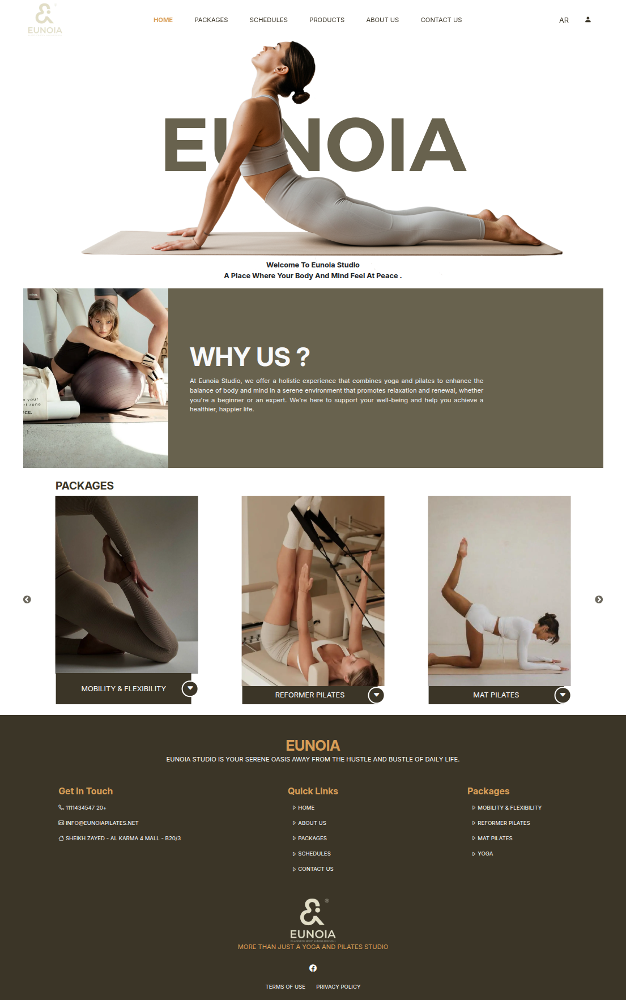
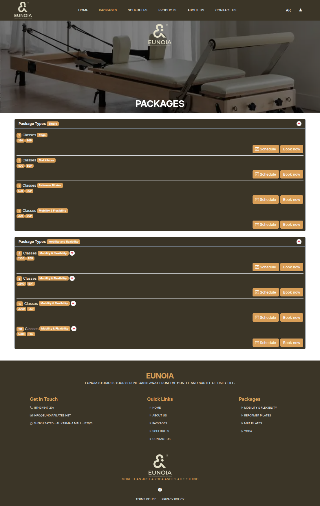
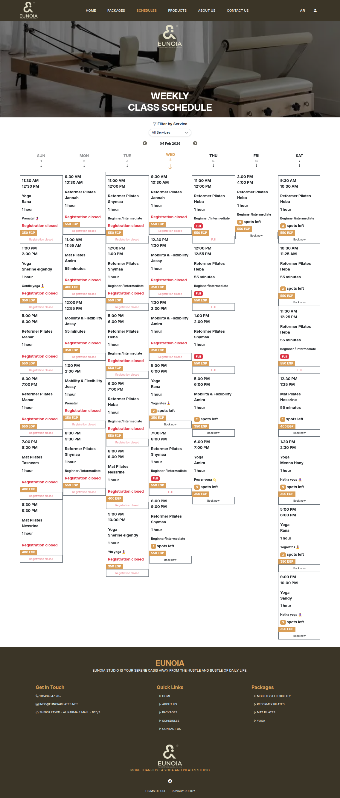
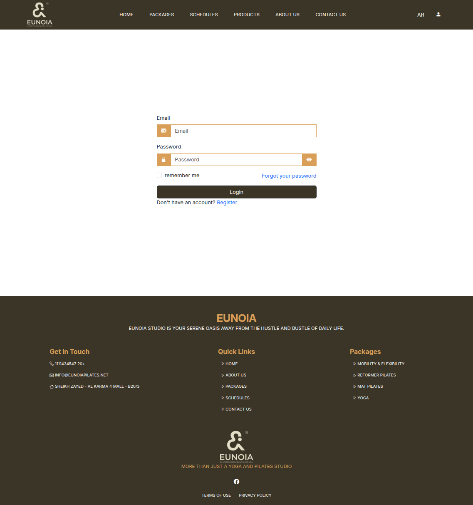

# Eunoia Pilates Management Platform

---

## 🌟 Executive Summary
**Eunoia** is a premium, high-performance studio management ecosystem specifically engineered for **Eunoia Pilates**. It serves as a comprehensive digital hub for core-focused wellness, managing specialized disciplines including **Mobility & Flexibility**, **Reformer Pilates**, **Mat Pilates**, and **Yoga**. The platform orchestrates the complex logistics of studio scheduling, trainer coordination, and multi-tier subscription models within a visually stunning and highly secure environment.

---

## 🛠 Core Studio Pillars

### 1. Adaptive Booking & Class Scheduling
The system provides two distinct, high-conversion flows for studio engagement:
- **Direct Session Booking:** Users can browse the dynamic weekly schedule and book a specific class at a specific time based on live availability.
- **Subscription Packages:** A flexible e-commerce flow where users purchase multi-session packages (credits) and subsequently reserve their preferred slots based on studio availability and package limitations.

### 2. Multi-Role Studio Infrastructure
The platform implements a strict role-based access control (RBAC) system tailored for studio operations:
- **Global Administrator:** Total operational control, including the management of Services (disciplines), individual Classes, Package Types, Subscriptions, and Product inventory.
- **Certified Studio Trainer:** A specialized interface optimized for tracking attendance and viewing live booking schedules for their assigned sessions.
- **Verified Studio Member:** An intuitive dashboard for tracking class credits, managing future bookings, and reviewing transaction history.

### 3. Integrated E-commerce & Payments
- **Dynamic Subscription Engine:** Automated credit management that handles complex business rules for different package tiers.
- **Studio Retail Marketplace:** A fully featured store for physical studio products with real-time order tracking.
- **Kashier Payment Gateway:** Secure, automated payment processing for both subscriptions and physical products.

---

## 🖥 Administrative Command Center
*Engineered for data-driven studio management and total operational oversight.*

### 📊 Business Intelligence & Analytics
- **Live Studio Metrics:** Real-time visualization of class occupancy, revenue trends, and member growth.
- **Data Granularity:** Advanced filtering by Member, Package Type, Service Discipline, or Payment Status.

### 👥 Member Security & Auditing
- **Security Auditing:** Real-time tracking of active sessions, featuring IP tracking and device fingerprinting to ensure member data security.
- **Member Management:** Full control over member accounts, verification status (OTP-based), and attendance history.

### 📅 Resource Orchestration
- **Service CMS:** Centralized management of studio disciplines (Yoga, Pilates, etc.) with localized metadata.
- **Trainer Coordination:** Secure linking of trainers to specific weekly schedules with automated capacity auditing.
- **SEO Optimization:** Integrated management of Meta assets and Open Graph protocols to drive studio visibility.

---

## 🏗 Technical Foundation

### Enterprise Tech Stack
- **Backend:** Laravel 12.0 (Modern architectural standards).
- **Database:** Optimized MySQL schemas with complex relational integrity.
- **Frontend:** Bootstrap 5.3 Framework, Slick Interactive components, and premium Vanilla CSS styling.
- **Security:** CSRF protection, salted hashing, and role-isolated middleware layers.

---

## 📸 System Gallery
 

---
 

---
 

---
 

---
 

---
 
